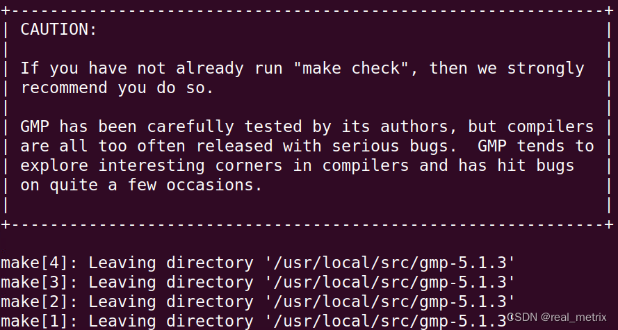
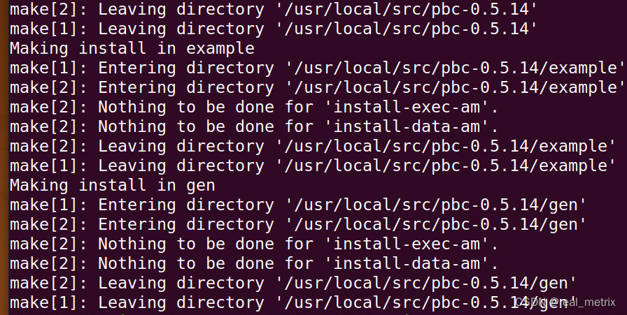
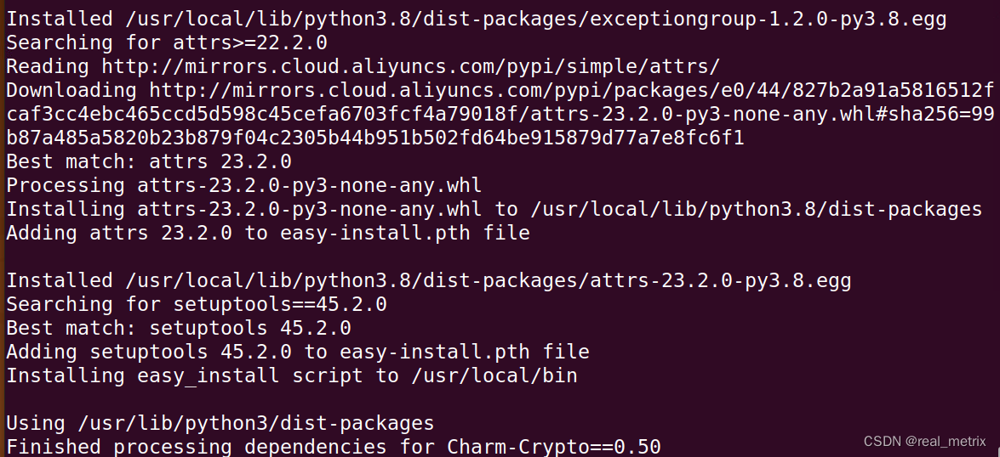

## 🔧 Installing Charm-Crypto on Ubuntu 20.04 LTS (VM Setup)

### 📥 Step 1: Prepare the Virtual Machine

1. **Download Ubuntu 20.04 LTS (64-bit)**  
   [📎 ubuntu-20.04.6-desktop-amd64.iso](https://releases.ubuntu.com/focal/ubuntu-20.04.6-desktop-amd64.iso)

2. **Create a Virtual Machine**  
   Use VMware (or any other hypervisor) to install Ubuntu 20.04 using the ISO.

> 💡 _Optional: Install [Visual Studio Code](https://code.visualstudio.com/download) inside the VM for a better coding experience._

---

### 📦 Step 2: Install Required Dependencies

Open a terminal and run the following:

```bash
sudo apt update
sudo apt install -y gcc make python3 m4 flex bison subversion python3-pip libgmp-dev libssl-dev unzip wget
```

Create a symlink so you can use `python` as an alias for `python3`:

```bash
sudo ln -s /usr/bin/python3 /usr/bin/python
```

Install a required Python package:

```bash
pip install pyparsing==2.4.6
```

---

### 📂 Step 3: Download Required Files

Navigate to your Downloads folder:

```bash
cd ~/Downloads/
```

Download the following files:

- **Charm-Crypto (dev branch)**  
  [📎 charm-dev.zip](https://github.com/JHUISI/charm/archive/refs/heads/dev.zip)

```bash
wget https://github.com/JHUISI/charm/archive/refs/heads/dev.zip -O charm-dev.zip
```

- **GMP (GNU Multi-Precision Arithmetic Library)**  
```bash
wget https://ftp.gnu.org/gnu/gmp/gmp-5.1.3.tar.bz2
```

- **PBC (Pairing-Based Cryptography Library)**  
```bash
wget https://crypto.stanford.edu/pbc/files/pbc-0.5.14.tar.gz
```

---

### 🛠️ Step 4: Extract and Install Libraries

Extract all source files to `/usr/local/src`:

```bash
sudo tar -jxvf gmp-5.1.3.tar.bz2 -C /usr/local/src
sudo tar -zxvf pbc-0.5.14.tar.gz -C /usr/local/src
sudo unzip charm-dev.zip -d /usr/local/src
```

---

### ⚙️ Step 5: Build and Install GMP

```bash
cd /usr/local/src/gmp-5.1.3/
sudo ./configure
sudo make
sudo make install
```

📸 Expected output:



---

### ⚙️ Step 6: Build and Install PBC

```bash
cd /usr/local/src/pbc-0.5.14/
sudo ./configure
sudo make
sudo make install
```

📸 Expected output:



---

### ⚙️ Step 7: Build and Install Charm-Crypto

```bash
cd /usr/local/src/charm-dev/
sudo ./configure.sh
sudo make
sudo make install
```

📸 Expected output:



---

✅ **Done!**  

Charm-Crypto should now be installed. You can test it with:

```bash
python -c "import charm; print('Charm is working ✅')"
```

Let me know if you’d like the same formatting adapted for Ubuntu 22.04 LTS or a lightweight version for `pip` installs with minimal native compilation.

---

[Source.](https://blog.csdn.net/qq_34902437/article/details/137404638)
